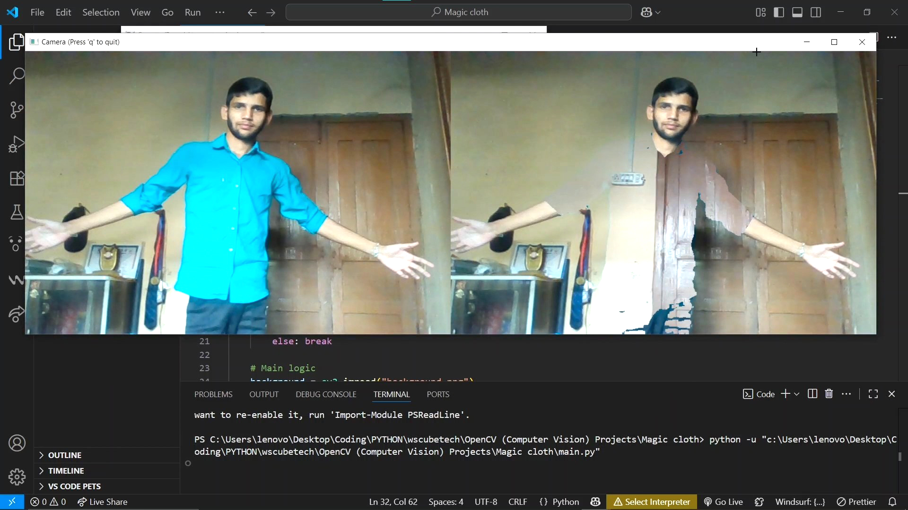

# Invisible Shirt Project

This project demonstrates a computer vision application that makes a shirt of a specific color appear **invisible** by replacing it with the captured background.  
It uses **OpenCV** and **NumPy** to detect the defined color range, mask it, and blend it with the background.

---

## 🚀 Features
- Capture live video feed using webcam.
- Capture the background with a single key press.
- Detect and mask a specific shirt color using **HSV color thresholding**.
- Replace the masked area with the background to create an invisibility effect.
- Real-time visualization with side-by-side original and processed output.

---

## 🛠️ Technologies Used
- **Python 3**
- **OpenCV**
- **NumPy**

---

## 🚀 Installation
1. Clone the repository:  
   ```bash
   git clone <repository-url>
   cd Invisible-Shirt-Project

2. Install the required dependencies:  
   ```bash
   pip install -r requirements.txt

3. Run the script:  
   ```bash
   python main.py

---

## 📷 Demo 



## 👨‍💻 Author  

Developed by **Uttam Kumar**  

- 🔗 GitHub: [Uttamkumar](https://github.com/Uttamkumar05072023)  
- 💼 LinkedIn: [Uttam Kumar](https://www.linkedin.com/in/uttam-kumar-88b7a9288/)